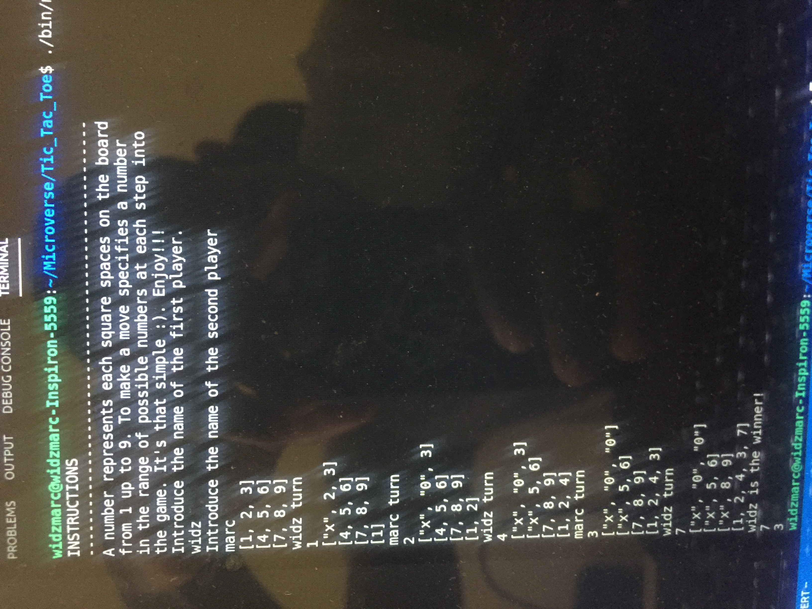

# Tic-Tac-Toe

> Tic tac toe is a game in which two players alternately put Xs and Os in compartments of a figure formed by two vertical lines crossing two horizontal lines and each tries to get a row of three Xs or three Os before the opponent does.. 

## Built With

- Ruby

## Getting Started

- Open the terminal command line.
- Clone the repo:--> git clone https://github.com/widzthedvloper/Tic_Tac_Toe.git
- cd Tic-Tac-Toe
- Enter ./bin/main.rb to start the game.

## Instructions
- Enter player's name as prompt in the terminal
- Enter a number from 1 upto 9 to make a move(choose a spot).
- You win when 3 of your symbols align vertically, horizontally or diagonally.
- After nine moves it's a draw if there's no winner

## Authors

👤 **Widzmarc Jean Nesly Phelle**

- GitHub: [@widzthedvloper](https://github.com/widzthedvloper)
- Twitter: [@widzthedvloper](https://twitter.com/widzthedvloper)
- LinkedIn: [@widzthedvloper](https://www.linkedin.com/in/widzmarc-jean-nesly-phelle-252a26129/))

## 🤝 Contributing

Contributions, issues, and feature requests are welcome!

## Show your support

Give a ⭐️ if you like this project!

## 📝 License

This project is [MIT](/LICENSE) licensed..